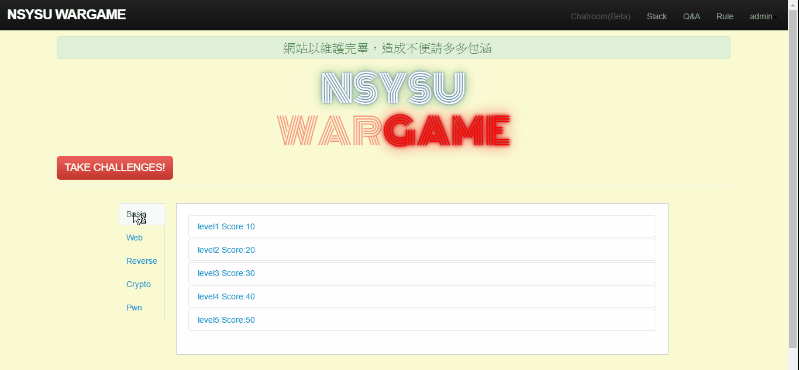

# Docker based Wargame Platform - To practice your CTF skills

**Relevant links:**
 [Github](https://github.com/qazbnm456/Docker-War) |
 [NSYSU Wargame](https://wargame.cse.nsysu.edu.tw)

---------------------------------------

##**Table of contents**

 * [Notice](#notice)
 * [TODO](#todos)
 * [Wiki](#wiki)
 * [Known issues](#issues)
 * [LICENSE](#license)

---------------------------------------

## Notice

Sometimes you may confront services looping forever, and this [link](http://stackoverflow.com/questions/11583562/how-to-kill-a-process-running-on-particular-port-in-linux) might helps you. Besides, if you wanna re-add the host, just delete the files in /var/lib/rancher/state.

Before using docker in Docker-War, [setup.sh](https://github.com/qazbnm456/Docker-War/blob/master/script/setup.sh) will change group of the docker.sock from docker(998) to app(9999) in order to let app user call docker in this image.

    $ sudo chgrp 9999 /run/docker.sock

## TODO

* Covering Unit Test and Integration Test.
* CI with [drone](https://github.com/drone/drone) and [dapper](https://github.com/rancher/dapper)
* Ability to change challenges on-the-fly.
* Move [term.js](https://github.com/rancher/term.js) to [xterm.js](https://github.com/sourcelair/xterm.js).
* (Optional) Instant notifications built with WebSocket.
* (Optional) Change to SPA.
* (Optional) Use [BTRFS](https://btrfs.wiki.kernel.org/index.php/Main_Page) or [ZFS](http://zfsonlinux.org) filesystem to storage images.
* (Optional) Importing the concept of [Continuous Deployment](http://rancher.com/continuous-deployment/).

## Wiki

### [Wiki](https://github.com/qazbnm456/Docker-War/wiki)

## Known issues

1. Change challenges on-the-fly is still unstable.
2. Some problems on setting up sqlchop proxy server.

## License

This project use [SATA License](LICENSE) (Star And Thank Author License), so you have to star this project before using. Read the [license](LICENSE) carefully.
